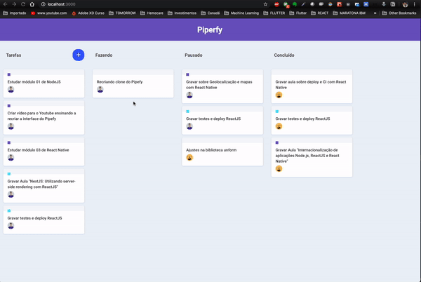

# Piperfy

## Descrição

Piperfy é um clone das funcionalidades de drag-and-drop do Pipefy.

## Bibliotecas

- `immer`
- `react`
- `react-hooks`
- `react-dnd`
- `react-dnd-html5-backend`
- `react-icons`
- `styled-components`
- `babel-eslint`
- `eslint`
- `prettier`
- `editor-config`

## Todo

- Possibilidar a criação de novos cards
- Remover dados de mock

## Resultado Final

